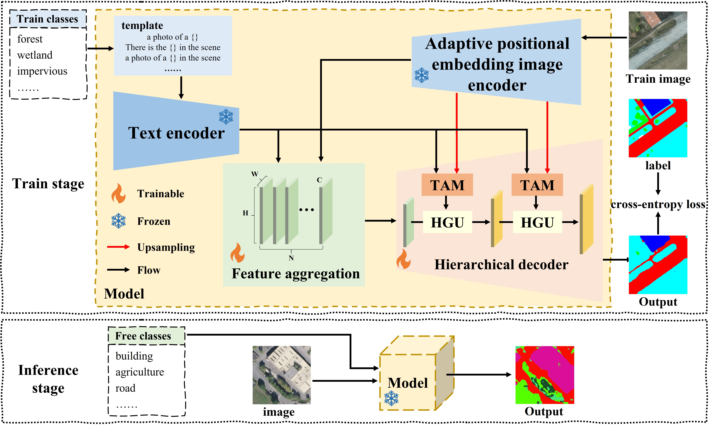

<div align="center">

<h1>HG-RSOVSSeg: Hierarchical Guidance Open-Vocabulary Semantic Segmentation Framework for High-Resolution Remote Sensing Images</h1>

<div>
    <h3><strong>HG-RSOVSSeg</strong></h3>
</div>

<div>
    <strong>Wubiao Huang</strong>, Fei Deng*, Huchen Li, Jing Yang
</div>

<div>
    <h4 align="center">
        This repository is an official implementation of  <a href="https://doi.org/10.3390/rs18020213" target='_blank'>[Paper]</a> <a href="https://github.com/HuangWBill/HG-RSOVSSeg/blob/master/paper.pdf" target='_blank'>[PDF]</a>
    </h4>
</div>

</div>

[](LICENSE.Apache-2.0)

___________

## Table of Contents
* [Abstract](#abstract)
* [Framework](#framework)
* [Installation](#installation)
* [Dataset](#dataset)
* [Training](#training)
* [Evaluation](#evaluation)
* [Results](#results)
* [Visualization](#visualization)
* [Model Zoo](#model-zoo)
* [Citation](#citation)
* [Acknowledgement](#acknowledgements)
* [Contact](#contact)

___________

## News

- [2026-7-6] The **models** have been released.
- [2026-7-6] The **codes** have been released.
- [2026-1-9] The **paper** has been accepted by ***Remote Sensing (RS)***.
- [2024-12-26] The work was completed.

## Abstract

> *Remote sensing image semantic segmentation (RSISS) aims to assign a correct class label to each pixel in remote sensing images and has wide applications. With the development of artificial intelligence, RSISS based on deep learning has made significant progress. However, existing methods remain more focused on predefined semantic classes and require costly retraining when confronted with new classes. To address this limitation, we propose the hierarchical guidance open-vocabulary semantic segmentation framework for remote sensing images (named HG-RSOVSSeg), enabling flexible segmentation of arbitrary semantic classes without model retraining. Our framework leverages pretrained text-embedding models to provide class common knowledge and aligns multimodal features through a dual-stream architecture. Specifically, we propose a multimodal feature aggregation module for pixel-level alignment and a hierarchical visual feature decoder guided by text feature alignment, which progressively refines visual features using language priors, preserving semantic coherence during high-resolution decoding. Extensive experiments were conducted on six representative public datasets, and the results showed that our method has the highest mean mIoU value, establishing state-of-the-art performance in the field of open-vocabulary semantic segmentation of remote sensing images.*


## Framework

<p align="center">

</p>

The overall architecture consists of

- CLIP Image Encoder
- CLIP Text Encoder
- Feature Aggregation Module
- Hierarchical Decoder

The image and text encoders remain frozen while the decoder learns to align multimodal representations for dense prediction.


## Installation

```bash
# 0. Basic environmental 
anaconda, cuda==11.8

# 1. create new anaconda env
conda create -n HG-RSOVSSeg python=3.9
conda activate HG-RSOVSSeg

# 2. git clone this repository
git clone https://github.com/HuangWBill/HG-RSOVSSeg.git
cd HG-RSOVSSeg

# 3. install torch and dependencies
pip install -r requirements.txt

# The mmcv, mmengine, mmsegmentation, torch, torchaudio and torchvision versions are strict.
```

Recommended environment

- Python 3.9
- CUDA 11.8
- torch 2.1.2
- mmcv 2.1.0
- mmengine 0.10.5
- mmsegmentation 1.2.1

---

## Dataset

The framework is evaluated on seven public datasets.

<table>
<tr>
<th>Dataset</th><th>Class</th><th>Link</th><th>Storage path</th>
</tr>
<tr>
<td>Potsdam</td><td>impervious surfaces, building, low vegetation,tree, car, background</td><td> <a href="(https://www.isprs.org/resources/datasets/benchmarks/UrbanSemLab/Default.aspx" target='_blank'>[ISPRS]</a></td><td>data\Potsdam_RGB_512</td>
</tr>
<tr>
<td>LoveDA</td><td>buildings, road, water, barren, forest, agriculture, background</td><td> <a href="(https://zenodo.org/records/5706578" target='_blank'>[LoveDA]</a></td><td>data\LoveDA_512</td>
</tr>
<tr>
<td>GID Large</td><td>built-up, farmland, forest, meadow, water, background</td><td> <a href="(https://captain.whu.edu.cn/GID/" target='_blank'>[GID Large]</a></td><td>data\GID Large_512</td>
</tr>
<tr>
<td>Globe230k</td><td> cropland, forest, grass, shrubland, wetland, water, tundra, impervious, bareland, ice, background</td><td> <a href="(https://doi.org/10.5281/zenodo.8429200" target='_blank'>[Globe230k]</a></td><td>data\Globe230k_512</td>
</tr>
<tr>
<td>FLAIR #1</td><td>building, pervious surface, impervious surface, bare soil, water, coniferous, deciduous, brushwood, vineyard, herbaceous vegetation, agricultural land, plowed land, background</td><td> <a href="(https://ignf.github.io/FLAIR/" target='_blank'>[FLAIR #1]</a></td><td>data\FLAIR1_512</td>
</tr>
<tr>
<td>OpenEarthMap</td><td>bareland, rangeland, developed space, road, tree, water, agriculture land, building, background</td><td> <a href="(https://open-earth-map.org" target='_blank'>[OpenEarthMap]</a></td><td>data\OpenEarthMap_512</td>
</tr>
<tr>
<td>LandCover.ai</td><td>buildings, woodlands, water, roads, background</td><td> <a href="(https://landcover.ai/" target='_blank'>[LandCover.ai]</a></td><td>data\LandCover_ai_512</td>
</tr>
</table>

- The datasets used in the paper are all **publicly available** and can be downloaded and preprocessed according to the description in the paper.
- **Strictly** organize data according to the example data.
- The experiments in this work were conducted using **Globe230k training set** for training, and testing sets from other datasets were used for testing.
- Based on the experimental conclusions of this paper, it is recommended to use the **training set of OpenEarthMap** for training and the testing set of other datasets for testing.

---

## Training
```bash
# train in Globe230k (single GPU)
python tools/train/train.py --config configs/Globe230k_my_model_512/HG-RSOVSSeg_vitl14_4xb2-80k_globe230k-512x512.py --work-dir result/HG-RSOVSSeg/Globe230k/

# train in Globe230k (multi GPU)
CUDA_VISIBLE_DEVICES=0,1,2,3 PORT=29560 bash python tools/train/dist_train.sh tools/train/train.py configs/Globe230k_my_model_512/HG-RSOVSSeg_vitl14_4xb2-80k_globe230k-512x512.py result/HG-RSOVSSeg/Globe230k/ 4

# train in OpenEarthMap (single GPU)
python tools/train/train.py --config configs/OpenEarthMap_my_model_512/HG-RSOVSSeg_vitl14_4xb2-80k_openearthmap-512x512.py --work-dir result/HG-RSOVSSeg/OpenEarthMap/

# train in OpenEarthMap (multi GPU)
CUDA_VISIBLE_DEVICES=0,1,2,3 PORT=29560 bash python tools/train/dist_train.sh tools/train/train.py configs/OpenEarthMap_my_model_512/HG-RSOVSSeg_vitl14_4xb2-80k_openearthmap-512x512.py result/HG-RSOVSSeg/OpenEarthMap/ 4
```

---

## Evaluation

```bash
# test in Globe230k (single GPU)
python tools/test.py --config configs/Globe230k_my_model_512/HG-RSOVSSeg_vitl14_4xb2-80k_globe230k-512x512_test.py --checkpoint result/HG-RSOVSSeg/Globe230k/iter_80000.pth --work-dir result/HG-RSOVSSeg/Globe230k/test/

# test in OpenEarthMap (single GPU)
python tools/test.py --config configs/OpenEarthMap_my_model_512/HG-RSOVSSeg_vitl14_4xb2-80k_openearthmap-512x512_test.py --checkpoint result/HG-RSOVSSeg/OpenEarthMap/iter_80000.pth --work-dir result/HG-RSOVSSeg/OpenEarthMap/test/
```
---

## Results

<table>
<tr>
<th rowspan=2>Method</th><th rowspan=2>trainset</th><th colspan=7>mIoU (%)</th><th rowspan=2>mean mIoU (%)</th><th rowspan=2>FLOPs (T)</th><th rowspan=2>Params (G)</th>
</tr>
<tr>
<td align="center">Potsdam</td><td align="center">LoveDA</td><td align="center">GID Large</td><td align="center">Globe230k</td><td align="center">FLAIR #1</td><td align="center">OpenEarthMap</td><td align="center">LandCover.ai</td>
</tr>
<tr>
<td align="center">LSeg</td><td align="center">Globe230k</td><td align="center">20.18</td><td align="center">31.99</td><td align="center">61.50</td><td align="center">-</td><td align="center">15.09</td><td align="center">28.72</td><td align="center">55.33</td><td align="center">35.47</td><td align="center">1.246</td><td align="center">0.551</td>
</tr>
<tr>
<td align="center">Fusioner</td><td align="center">Globe230k</td><td align="center">19.05</td><td align="center">36.11</td><td align="center">56.49</td><td align="center">-</td><td align="center">13.91</td><td align="center">26.35</td><td align="center">56.20</td><td align="center">34.69</td><td align="center">1.078</td><td align="center">0.462</td>
</tr>
<tr>
<td align="center">SAN</td><td align="center">Globe230k</td><td align="center">11.72</td><td align="center">24.16</td><td align="center">40.60</td><td align="center">-</td><td align="center">10.24</td><td align="center">17.74</td><td align="center">53.43</td><td align="center">26.32</td><td align="center">1.066</td><td align="center">0.436</td>
</tr>
<tr>
<td align="center">Cat-Seg</td><td align="center">Globe230k</td><td align="center">17.59</td><td align="center">34.48</td><td align="center">39.81</td><td align="center">-</td><td align="center">19.77</td><td align="center">19.28</td><td align="center">46.05</td><td align="center">29.50</td><td align="center">1.022</td><td align="center">0.433</td>
</tr>
<tr>
<td align="center">HG-RSOVSSeg</td><td align="center">Globe230k</td><td align="center">22.85</td><td align="center">36.15</td><td align="center">67.63</td><td align="center">-</td><td align="center">12.54</td><td align="center">27.74</td><td align="center">57.71</td><td align="center">37.44</td><td align="center">1.036</td><td align="center">0.433</td>
</tr>
<tr>
<td align="center">HG-RSOVSSeg</td><td align="center">OpenEarthMap</td><td align="center">39.59</td><td align="center">62.58</td><td align="center">58.21</td><td align="center">28.02</td><td align="center">14.92</td><td align="center">-</td><td align="center">87.23</td><td align="center">48.43</td><td align="center">1.036</td><td align="center">0.433</td>
</tr>
</table>

---

## Visualization

<p align="center">

</p>

---

## Model Zoo

|        Backbone        | Training Dataset |  Device   | Iterations | Mean mIoU | Checkpoint  |
|:----------------------:|:----------------:|:---------:|:----------:|:---------:|:-----------:|
| GeoRSCLIP ViT-L-14-336 |    Globe230k     | RTX4090D  |   80000    |   37.44   | [download](https://zenodo.org/records/21212353/files/iter_80000_Globe230k.pth?download=1) |
| GeoRSCLIP ViT-L-14-336 |   OpenEarthMap   | RTX4090D  |   80000    |   48.43   | [download](https://zenodo.org/records/21212353/files/iter_80000_OpenEarthMap.pth?download=1) |
---

## Citation

If you find this work useful, please cite

```bibtex
@Article{rs18020213,
  AUTHOR = {Huang, Wubiao and Deng, Fei and Li, Huchen and Yang, Jing},
  TITLE = {HG-RSOVSSeg: Hierarchical Guidance Open-Vocabulary Semantic Segmentation Framework of High-Resolution Remote Sensing Images},
  JOURNAL = {Remote Sensing},
  VOLUME = {18},
  YEAR = {2026},
  NUMBER = {2},
  ARTICLE-NUMBER = {213},
  URL = {https://www.mdpi.com/2072-4292/18/2/213},
  ISSN = {2072-4292},
  DOI = {10.3390/rs18020213}
}
```

---

## Acknowledgements

Our implementation is built upon

- OpenMMLab
- MMSegmentation
- CLIP
- Cat-Seg

We sincerely thank the authors for making their excellent work publicly available.

---

## Contact
If you have any questions or suggestions, feel free to contact [Wubiao Huang](huangwubiao@whu.edu.cn).

